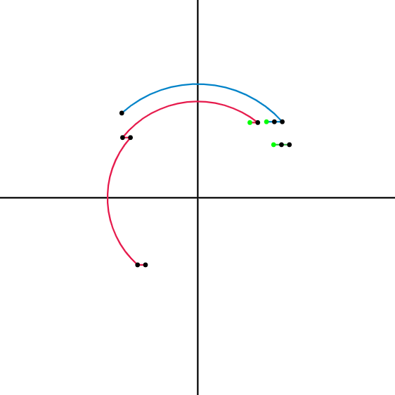
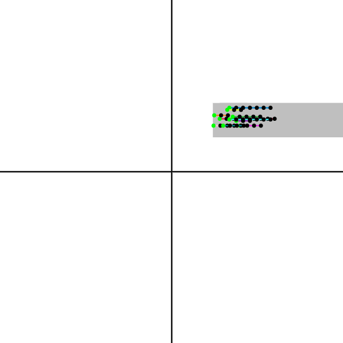

# Domains Oxide 

Toy language to help experiment with numerical domains for abstract interpretation. The language is inspired by the following book:

```
  Rival, Xavier, and Kwangkeun Yi. Introduction to static analysis: an abstract interpretation perspective. Mit Press, 2020.
```

This repo is the reimplementation of [domains](https://github.com/Xazax-hun/domains) in Rust.

The goal is to build a framework that helps experimenting with numerical domains and static analysis methods to
infer which regions in the 2D space are reachable by the programs written in the graphical language.
To get basic syntax highlight for the language install `utils/ide/trlang/trlang.vsix` extension to VS code.

# Running the interpreter

Consider the following example program from the book:
```
init(50, 50, 50, 50);
translation(10, 0);
iter {
  { translation(10, 0) } or { rotation(0, 0, 90) }
}
```

Running `./domains-driver example.tr --svg --executions 3` will output the SVG to the standard output
that visualizes some execution traces of the program. Alternatively, once can do
`cargo run -- example.tr --svg --executions 3` instead.
An execution is defined as a random walk of the control flow graph.

## Output:



# Running the analyzer

Consider the following small program:
```
init(50, 50, 50, 50);
iter {
  {
    translation(10, 0)
  } or {
    translation(0, 10)
  }
};
rotation(0, 0, 180)
```
Running `./domains-driver signDemo.tr --analyze sign` will print out the same program along with
some annotations. The annotations will contain the facts that the analyzer was able to
infer about the program. In this case, the output will be:
```
init(50, 50, 50, 50) /* { x: Positive, y: Positive } */;
iter {
  {
    translation(10, 0) /* { x: Positive, y: Positive } */
  } or {
    translation(0, 10) /* { x: Positive, y: Positive } */
  }
};
rotation(0, 0, 180) /* { x: Negative, y: Negative } */
```

## Another example:

Running `./domains-driver filename.tr --analyze interval` on:
```
init(50, 50, 50, 50);
translation(10, 0);
iter {
  translation(10, 0)
}
```
will output:
```
init(50, 50, 50, 50) /* { x: [50, 100], y: [50, 100] } */;
translation(10, 0) /* { x: [60, 110], y: [50, 100] } */;
iter {
  translation(10, 0) /* { x: [70, inf], y: [50, 100] } */
}
```
Alternatively, we can visualize the analysis result along with some executions
running `./domains-driver filename.tr --analyze interval --svg --executions 10 --loopiness 5`.
The gray area represents the regions  of the 2D space that the analysis deduced as reachable.

# Running the interpreter
